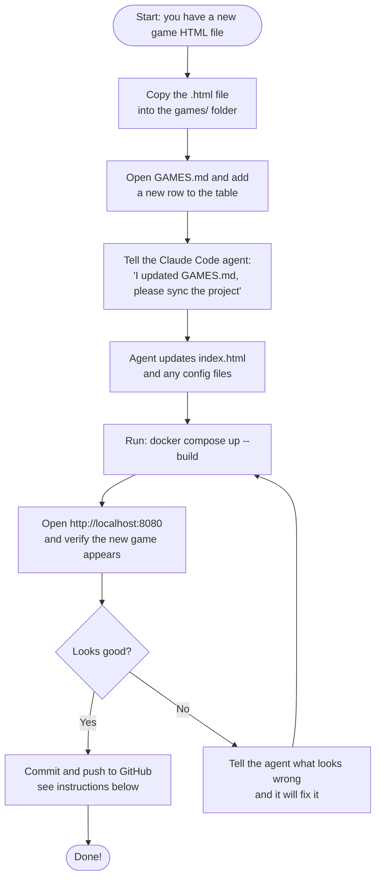
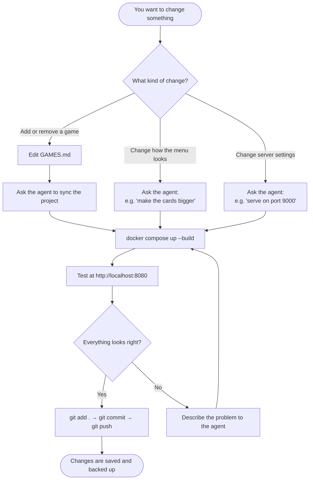

# Daigle Games

A collection of single-page HTML games, served from an NGINX web server running inside a Docker container. A menu page lists all available games and links to them.

---

## What This Agent Does For You

You have instructed the Claude Code agent to:

1. **Read `GAMES.md`** — This file is the single source of truth for your game library. It is a simple table with two columns: the game's display name and the path to its HTML file.

2. **Maintain `index.html`** — Every time you update `GAMES.md`, the agent updates the menu page to match. Each game appears as a clickable card on the home screen.

3. **Maintain the NGINX container** — The agent keeps the `Dockerfile`, `nginx.conf`, and `docker-compose.yml` up to date so the web server always reflects your current game list.

---

## Project Structure

```
DaigleGames/
├── games/                   ← Put your game HTML files here
│   └── Bebe And Baba 1.html
├── index.html               ← Auto-generated menu page (do not edit by hand)
├── GAMES.md                 ← YOU edit this to add/remove games
├── nginx.conf               ← NGINX server configuration
├── Dockerfile               ← Instructions for building the container image
├── docker-compose.yml       ← Shortcut for running the container
└── README.md                ← This file
```

---

## Prerequisites

Before you begin, make sure you have the following installed:

- **Docker Desktop** — [https://www.docker.com/products/docker-desktop](https://www.docker.com/products/docker-desktop)
- **Git** — [https://git-scm.com/downloads](https://git-scm.com/downloads)

To verify they are installed, open a terminal (PowerShell on Windows) and run:

```powershell
docker --version
git --version
```

Both commands should print a version number, not an error.

---

## How to Build and Run the Docker Container

Open a terminal, navigate to this folder, then run:

```powershell
# Step 1 — Build the image and start the container
docker compose up --build
```

- The first time this runs it will take a minute to download the base image.
- Once you see `daigle-games  | ... start worker process`, it is ready.

Open your browser and go to:

```
http://localhost:8080
```

You should see the game menu.

**To stop the container**, press `Ctrl + C` in the terminal, then run:

```powershell
docker compose down
```

**To restart without rebuilding** (nothing has changed):

```powershell
docker compose up
```

---

## How to Add a New Game



### Step-by-step written version

1. **Copy your game file** into the `games/` folder.

2. **Edit `GAMES.md`** — add one row to the table:

   ```
   | My New Game | ./games/my-new-game.html |
   ```

3. **Ask the agent to sync** — type something like:
   > "I updated GAMES.md, please update the project."

4. **Rebuild and test** — run `docker compose up --build` and check `http://localhost:8080`.

5. **Commit and push** — follow the section below.

---

## How to Commit and Push to GitHub

> **What is this?** Git saves a history of every change you make. GitHub is a website where that history is stored online, so your work is backed up and shareable.

### One-time setup (only do this once)

If you have not already connected this folder to a GitHub repository:

1. Create a new repository on [https://github.com](https://github.com) — click **New**, give it a name (e.g. `DaigleGames`), and click **Create repository**.

2. In your terminal, run these commands one at a time:

   ```powershell
   git init
   git remote add origin https://github.com/YOUR-USERNAME/DaigleGames.git
   ```

   Replace `YOUR-USERNAME` with your actual GitHub username.

### Every time you make changes

Run these four commands in order:

```powershell
# 1. See what has changed
git status

# 2. Stage all changes (prepare them to be saved)
git add .

# 3. Save the changes with a short description
git commit -m "Add new game: My Game Name"

# 4. Upload to GitHub
git push origin main
```

> **Tip:** The message in quotes after `-m` is just a note to your future self. Write something short that describes what changed.

---

## How to Maintain This Project Over Time



### Golden rules

| Rule | Why |
|------|-----|
| **Only edit `GAMES.md` yourself** — let the agent update everything else. | Prevents the menu page and the game list from getting out of sync. |
| **Always rebuild after any change** (`docker compose up --build`). | The container does not pick up file changes automatically. |
| **Commit after every working change.** | Gives you a safe point to roll back to if something breaks later. |
| **Never manually edit `index.html`.** | The agent regenerates it from `GAMES.md`; your edits will be overwritten. |

---

## Troubleshooting

| Problem | Fix |
|---------|-----|
| `docker: command not found` | Docker Desktop is not installed or not running. Start it first. |
| Port 8080 is already in use | Change `"8080:80"` to `"8090:80"` in `docker-compose.yml` and use `http://localhost:8090`. |
| Game page shows a 404 error | Check that the filename in `GAMES.md` exactly matches the file in `games/` (including capital letters). |
| Menu looks outdated | You forgot to rebuild. Run `docker compose up --build` again. |
| `git push` asks for a password | GitHub now requires a Personal Access Token. See: [https://docs.github.com/en/authentication/keeping-your-account-and-data-secure/creating-a-personal-access-token](https://docs.github.com/en/authentication/keeping-your-account-and-data-secure/creating-a-personal-access-token) |
